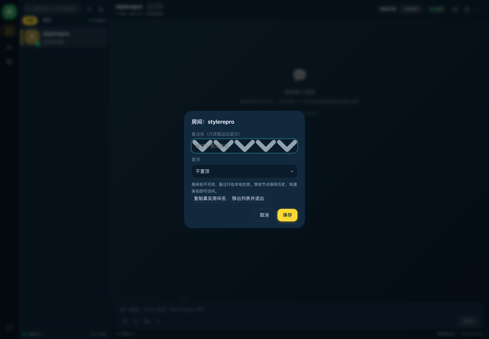
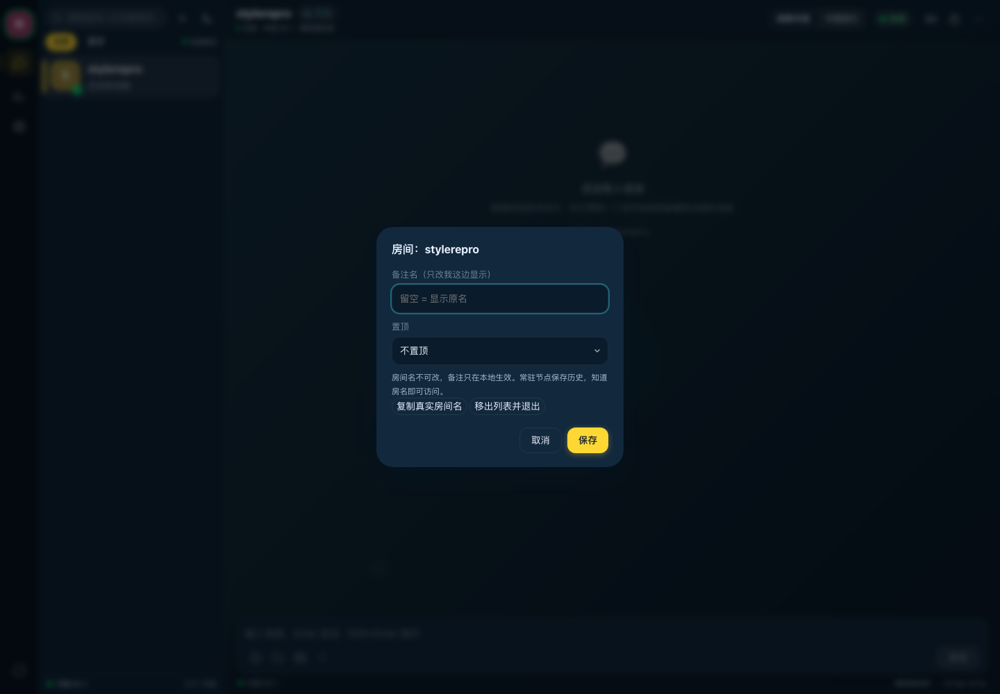

# 2026-10-10 修：深色主题下「备注名」输入框里冒出一排巨大灰色箭头

## 一句话

一行深色主题的 CSS 选择器写得太宽（`.dialog__field` 不只匹配 `<select>`，
还匹配文本输入框），于是下拉箭头那张 SVG 被铺满并平铺进了输入框。

## 现象（用户实测报上来的）

深色主题 → 侧栏房间菜单 → 弹窗里「备注名（只改我这边显示）」输入框内
出现一排巨大的灰色 V 形箭头，把 placeholder 盖住：



修复后：



## 根因

`frontend/css/components.css` 里那条"深色主题把箭头换成浅色"的规则：

```css
/* 改之前 */
[data-theme="dark"] .mini-select,
[data-theme="dark"] .dialog__field {   /* ← 这里太宽了 */
  background-image: url("data:image/svg+xml,…chevron…");
}
```

`.dialog__field` 这个类**同时**挂在两个地方：

| 元素 | 出处 | 该有箭头吗 |
|---|---|---|
| `<select id="dlg-pin" class="dialog__field">`（置顶） | `frontend/js/ui/sidebar.js` | ✅ 有 |
| `<input id="dlg-alias" class="dialog__field">`（备注名） | `frontend/js/ui/sidebar.js` | ❌ 不该有 |
| `<input id="dlg-input" class="dialog__field">`（通用输入框） | `frontend/js/ui/dialog.js` | ❌ 不该有 |

而这条规则**只加了 `background-image`**，`background-size` / `background-repeat` /
`background-position` 是靠**另一条**只针对 `select` 的规则给的。
于是文本输入框拿到的是一张"没人管尺寸"的图，落回浏览器默认值
（`auto` + `repeat` + `0% 0%`）：

那张 SVG 是 `viewBox="0 0 8 5"` 而**没有 `width`/`height`** —— 没有内在尺寸的 SVG
当背景图、又没有 `background-size` 时，浏览器按**元素大小**当一块瓷砖，
再 `repeat` 铺开 ⇒ 深色主题下输入框里就是一排巨大箭头。

浏览器里读到的计算样式（证据，修复前）：

```json
"input":  { "size": "auto",     "repeat": "repeat",    "pos": "0% 0%" }
"select": { "size": "8px 5px",  "repeat": "no-repeat", "pos": "calc(100% - 11px) 50%" }
```

**为什么浅色主题没事**：浅色的 `.dialog__field` 规则里根本没有这张图。
**为什么设置页的 select 没事**：`select.dialog__field` 那条规则带全了 size/repeat。

## 修法

把选择器收窄到 select（`frontend/css/components.css`）：

```css
[data-theme="dark"] .mini-select,
[data-theme="dark"] select.dialog__field { … }
```

并在原地写清"为什么必须限定到 select"（这次的坑就是这么来的，注释里留了证据）。

## 顺手做的同类扫描

把 `frontend/css/*.css` 里所有 `background-image: url("data:image/svg…")` 的规则
全捞出来，检查"带图却没给 size/repeat"的组合 —— **全仓只有这一处**：

| 位置 | size / repeat | 判定 |
|---|---|---|
| `components.css` `.mini-select` | `8px 5px` / `no-repeat` | ✅ |
| `components.css` `[data-theme=dark] .mini-select, .dialog__field` | 无 / 无 | ❌ **就是它** |
| `components.css` `.dialog__field[type=select], select.dialog__field` | `8px 5px` / `no-repeat` | ✅ |

另外在真实浏览器里遍历深色主题下所有 `input/select/textarea/[class*=field]`，
断言"带背景图 ⇒ 必须有明确的 size 且不平铺"：修复后**零命中**。

## 验证

| 项 | 结果 |
|---|---|
| 真实浏览器复现 | 修复前 1:1 复现（截图见上），计算样式如上 |
| 修复后 | 深色/浅色两个主题下输入框 `background-image: none`，select 仍是小箭头 |
| 深色主题巡检 | 设置页 / 连接状态 / 聊天页截图逐一看过，无同类问题；自动扫描"带图不设尺寸"零命中 |
| `bash scripts/verify.sh all` | **退出码 0**（含 redesign / sidebar-pages / theme-sync 等 23 组浏览器套件，全 0 失败） |

## 发版

- 只改了 CSS（前端），**wasm 没动**；Cloudflare 那次上传也只报了 1 个变更文件
  （`/css/components.css`），其余 34 个复用 —— 与"只动了这一行"相符。
- 发版时 `deploy-web.sh` 的"wasm 比源码旧"闸门**报了一次**：`git checkout main`
  把 `.rs` 的 mtime 刷新了，而闸门比的是 mtime。按仓库既定做法重跑
  `bash scripts/build-wasm.sh release` 后，**重编产物与线上那份逐字节相同**
  （`265b33b5ebf17166`）—— 证实是假警报，内容一个字节没变，所以上面那轮浏览器回归
  的结论继续成立（它跑的正是这份 wasm）。
- 前端：Cloudflare Worker `iroh-chatroom` → 版本 **`fec066c5-fe64-476c-9549-ae3370bf75ea`**；
  `css/components.css` 线上哈希 `b1370cdb85b73087`（与本地 `dist/site` 一致），
  `pkg/iroh_web_bg.wasm` 线上仍是 `265b33b5ebf17166`（未变）。
- 回滚：把 CF 版本切回 `e152e816-4b39-4361-898b-ddd3d3af3ba4`（纯 CSS 变更，无数据/schema 影响）。
